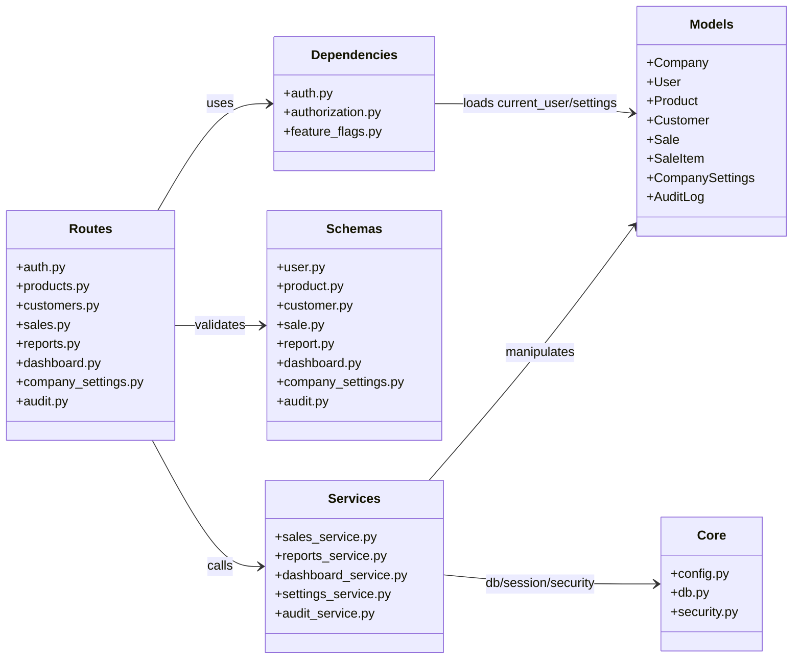
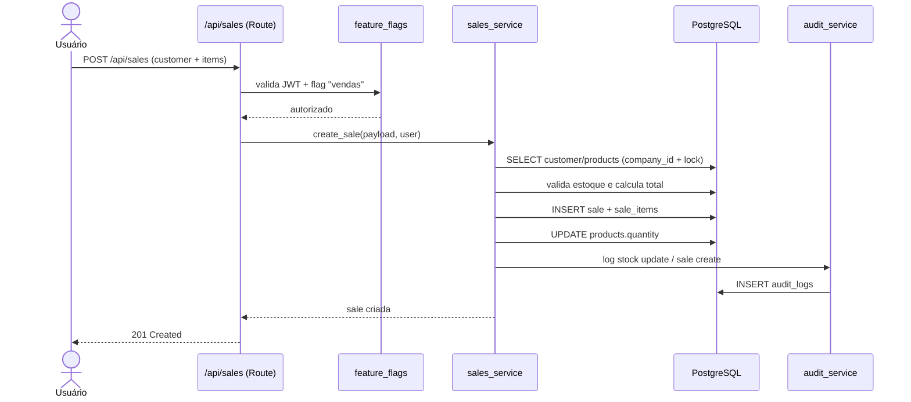

# Controle de Estoque — SaaS multiempresa

Aplicação **Controle de Estoque** (mini ERP SaaS): estoque, clientes, vendas, relatórios e dashboard, organizada em camadas:

- `core`
- `models`
- `schemas`
- `routes`
- `services`
- `dependencies`

Tecnologias atuais:

- FastAPI
- SQLAlchemy 2.x
- PostgreSQL
- Alembic
- JWT
- Pydantic
- Frontend HTML/CSS/JS + Chart.js
- Docker Compose (opcional, para subir app + Postgres com um comando)
- Pyright para análise estática de tipos em Python

## Status do projeto

O projeto cobre os requisitos centrais do mini ERP SaaS multiempresa com ativacao por pagamento (Mercado Pago) ou plano **Free** imediato, perfis de usuario na empresa (incluindo administrador da empresa) e auditoria expandida.

Status resumido:

- Implementado: estoque, clientes, vendas (unidade ou **peso/kg** com balança serial no navegador), dashboard, relatorios, exportacao PDF/impressao (conforme plano e flags), personalizacao visual, feature flags, **recuperacao de senha**, **cobranca de planos pagos via Mercado Pago** (Checkout Pro), ativacao automatica apos pagamento ou plano **Free** imediato, limites por plano (`app/core/plans.py`), **auditoria expandida** (ver [README-AUDITORIA-BANCO.md](README-AUDITORIA-BANCO.md)) e ambiente local via **Docker Compose**
- Testes automatizados: `tests/test_billing_security.py` e `tests/test_internal_security.py`; instruções de análise de tipos estão em [README-PYRIGHT.md](README-PYRIGHT.md)

## Módulos implementados hoje

- Gestão de produtos/estoque (validade obrigatória; **venda por peso opcional** em kg com estoque `weight_stock_kg`)
- Gestão de clientes (e-mail e CPF opcionais conforme cadastro)
- Vendas com itens por **quantidade** ou **peso (kg)**; integração com **balança USB** via Web Serial (`web/scale.js`, Chrome/Edge)
- Auditoria completa com `before_data`, `after_data`, `ip_address`, `user_agent`, login com sucesso e falha, CRUDs e vendas
- Relatórios (dia, mês, faturamento, top produtos, histórico)
- Exportação de relatório em PDF e impressão (plano **Premium**)
- Dashboard com métricas, gráficos e alertas avançados
- `CompanySettings` com personalização visual e feature flags por empresa
- Fluxo de cadastro com escolha de plano (`free`, `basic`, `professional`, `premium`) e ciclo **mensal/anual**; planos pagos usam **Mercado Pago** para pagamento
- Entrada por SKU para uso com leitor de código de barras no fluxo de venda
- Arquivos na raiz: `Dockerfile`, `compose.yaml`, [README-DOCKER.md](README-DOCKER.md), [README-SOLUCAO-ERROS.md](README-SOLUCAO-ERROS.md), [README-USUARIO.md](README-USUARIO.md), [README-AUDITORIA-BANCO.md](README-AUDITORIA-BANCO.md), [README-TECNOLOGIAS.md](README-TECNOLOGIAS.md), [README-SEGURANCA.md](README-SEGURANCA.md), [README-CSS.md](README-CSS.md)

## Conformidade com a especificação original

Implementado:

- FastAPI, SQLAlchemy, PostgreSQL, Alembic, Pydantic, JWT e `bcrypt` (hash de senhas)
- Arquitetura em camadas: `core`, `models`, `schemas`, `routes`, `services`, `dependencies`
- Entidades principais de produto, cliente, venda, item de venda, configuracoes da empresa e auditoria
- Frontend em HTML, CSS e JavaScript com Chart.js
- Isolamento de dados por `company_id` nas consultas principais
- `Company.status` com `pending`, `active` e `blocked`
- `Company.plan` com `free`, `basic`, `professional` e `premium` (ver `app/core/plans.py`)
- `Company.billing_cycle` com `monthly` e `annual`
- `Company.payment_status` com `pending`, `paid`, `past_due` e `canceled`
- `Company.mercado_pago_reference` e `Company.paid_until` para conciliacao com **Mercado Pago**
- `User.role` com `admin` (administrador **da empresa**) e `user` — **nao** ha neste repositorio painel nem API de operador multiempresa
- Auditoria global e por empresa
- Leitura por SKU para fluxo com leitor de codigo de barras

Pendente:

- Pyright configurado para analisar `app/` e `tests/` (consulte [README-PYRIGHT.md](README-PYRIGHT.md))

## Multi-tenant e segurança atuais

- Todas as entidades de negócio possuem `company_id`
- Todas as consultas filtram por `company_id` do usuário autenticado
- JWT obrigatório nas rotas protegidas
- Validação com Pydantic
- Feature flags por empresa (ex: `vendas`, `relatorio`, `dashboard_avancado`)
- Bloqueio global em rotas autenticadas quando `company.status != "active"` (usuario comum ou `User.role == admin` **na empresa**: enquanto a empresa nao estiver `active`, nao ha acesso ao ERP; ajuste de status/plano faz-se pelo fluxo de pagamento, ou manualmente na base quando necessario)
- Permissões por operação nas rotas da empresa (`products:read`, `products:write`, etc.) via `app/dependencies/authorization.py` e `app/core/authorization.py` (dono da empresa equivale a perfil com mais permissões)

Observações importantes:

- Novas empresas no plano **`free`** nascem com `status = active` e `payment_status = paid` (acesso imediato)
- Planos **pagos** (`basic`, `professional`, `premium`): apos o cadastro, `status = pending` ate a confirmacao do pagamento no **Mercado Pago**; entao passam a `active` (via retorno do checkout e/ou webhook)
- Empresas **bloqueadas** (`blocked`) ficam sem acesso ao ERP ate regularizacao
- O arquivo **`.env`** e lido a partir da **raiz do repositorio** (ver `app/core/config.py`) e continua ignorado pelo Git. No **Docker Compose**, `DATABASE_URL` do container é montada com `POSTGRES_USER`, `POSTGRES_PASSWORD` e `POSTGRES_DB`; configure essas variáveis localmente no `.env`.

## Planos comerciais e limites

O campo `Company.plan` aceita **`free`**, **`basic`**, **`professional`** e **`premium`**. Os tetos por plano (produtos, clientes, usuarios, vendas, relatorios, etc.) e as capacidades estao centralizados em **`app/core/plans.py`** (`PLAN_CAPS`, `PLAN_CAPABILITIES`, `PLAN_OFFERS`). O servico **`app/services/plan_limits_service.py`** aplica esses limites nas rotas.

Precos de referencia exibidos ao usuario (mensal / anual) estao em `PLAN_OFFERS` no mesmo arquivo (ex.: Basic R$ 59/mes, Professional R$ 129/mes, Premium R$ 249/mes; anual com logica comercial de 10x o mensal).

O endpoint **`GET /api/auth/me`** devolve `company_plan` e **`plan_usage`** (uso, tetos e flags de capacidade) para o frontend.

### `User.role == admin` e status da empresa

- **`role = admin`** e o perfil de administrador **dentro da empresa** (mais permissoes que `user`). **Nao** representa um operador que gere varias empresas pelo mesmo painel neste projeto.
- **Plano e status da empresa** valem para todos os usuarios da empresa: se `company.status` for `pending` ou `blocked`, **ninguem** dessa empresa acessa o ERP ate regularizacao ou ajuste em dados (por exemplo atualizar `company` no banco, conforme sua operacao).

## Pagamentos — Mercado Pago

O **unico provedor de pagamento** implementado para planos pagos e o **Mercado Pago** (API REST, preferencias de checkout).

| Etapa | Descricao |
|-------|-----------|
| Cadastro | Plano **free**: empresa fica **active** na hora. Planos **pagos**: empresa **pending** ate o pagamento. |
| Token de cobranca | Apos registro de plano pago, a API pode devolver `billing_access_token` (JWT de escopo checkout) para o front abrir o fluxo de pagamento com seguranca. |
| Checkout | `POST /api/billing/mercado-pago/checkout` cria a **preferencia** Checkout Pro e retorna a URL (`init_point`) do Mercado Pago. |
| Retorno | `GET /api/billing/mercado-pago/confirm` confirma o pagamento quando o usuario volta do Mercado Pago. |
| Webhook | `POST /api/billing/mercado-pago/webhook` recebe notificacoes do Mercado Pago para conciliar em segundo plano. |

**Variaveis de ambiente** (ver tambem `app/core/config.py` e `app/services/billing_service.py`):

- **`MERCADO_PAGO_ACCESS_TOKEN`** (obrigatorio para criar checkout de planos pagos)
- **`APP_BASE_URL`** (obrigatorio para `back_urls` e URL padrao de webhook interno)
- `MERCADO_PAGO_PUBLIC_KEY` (opcional; reservada para evolucoes no front)
- `MERCADO_PAGO_API_BASE_URL` (opcional; padrao `https://api.mercadopago.com`)
- `MERCADO_PAGO_NOTIFICATION_URL` (opcional; se vazio, o webhook padrao aponta para `{APP_BASE_URL}/api/billing/mercado-pago/webhook`)

Formas de pagamento disponiveis no fluxo do Mercado Pago (cartao, Pix, etc.) seguem a **configuracao da conta e do Checkout Pro** no painel do Mercado Pago, nao um segundo gateway no codigo deste repositorio.

## Estrutura de banco (migrations)

- `0001_init`: base do controle de estoque
- `0002_mini_erp`: `company_settings`, `customers`, `sales`, `sale_items`
- `0003_access_admin_audit`: `company.status`, `company.plan`, `user.role` e auditoria expandida
- `0004_customer_optional`: permite venda sem cliente (`sales.customer_id` opcional)
- `0005_company_owner`: flag `is_company_owner` em `users`
- `0006_company_billing_fields`: `billing_cycle`, `payment_status`, `mercado_pago_reference` e `paid_until` em `companies`
- `0007_reclaim_free_plan`: normalizacao de registros legados para o plano `free`
- `0008_expand_limited_full_access`: ajustes de acesso/limites e features
- `b8498e564285`: coluna `validity` em `products`
- `5b8a849fe51b`: campo `cpf` opcional em `customers`
- `c7e2f1a0b9d3`: remove restricao UNIQUE global so em `customers.cpf` (mantem `uq_customers_company_cpf`; varios clientes sem CPF por empresa)
- `d4a8b2c1e5f6`: produtos por peso (`sold_by_weight`, `weight_stock_kg`, `min_weight_kg`) e itens de venda com `weight_kg` (revisao atual **head**)

Historico completo das migrations e relacao com `audit_logs`: [README-AUDITORIA-BANCO.md](README-AUDITORIA-BANCO.md).

## DER atual (implementado)

```mermaid
erDiagram
    COMPANIES {
        int id PK
        string name UNIQUE
        string status
        string plan
        string billing_cycle
        string payment_status
        string mercado_pago_reference
        datetime paid_until
        datetime created_at
    }

    USERS {
        int id PK
        int company_id FK
        string email UNIQUE
        string full_name
        string hashed_password
        string role
        bool is_company_owner
        bool is_active
        datetime created_at
    }

    PRODUCTS {
        int id PK
        int company_id FK
        string name
        string sku
        string description
        int quantity
        datetime validity
        int min_quantity
        bool sold_by_weight
        decimal weight_stock_kg
        decimal min_weight_kg
        decimal price
        datetime created_at
        datetime updated_at
    }

    CUSTOMERS {
        int id PK
        int company_id FK
        string name
        string email
        string phone
        datetime created_at
        datetime updated_at
    }

    SALES {
        int id PK
        int customer_id FK
        int company_id FK
        decimal total_value
        datetime created_at
    }

    SALE_ITEMS {
        int id PK
        int sale_id FK
        int product_id FK
        int company_id FK
        int quantity
        decimal weight_kg
        decimal price
    }

    COMPANY_SETTINGS {
        int id PK
        int company_id FK UNIQUE
        string theme
        string logo_url
        string primary_color
        json features
        datetime created_at
        datetime updated_at
    }

    AUDIT_LOGS {
        int id PK
        string action
        string entity
        int entity_id
        int user_id FK
        int company_id FK
        string ip_address
        string user_agent
        json before_data
        json after_data
        string description
        datetime created_at
    }

    COMPANIES ||--o{ USERS : has
    COMPANIES ||--o{ PRODUCTS : has
    COMPANIES ||--o{ CUSTOMERS : has
    COMPANIES ||--o{ SALES : has
    COMPANIES ||--o{ SALE_ITEMS : has
    COMPANIES ||--|| COMPANY_SETTINGS : has
    COMPANIES ||--o{ AUDIT_LOGS : has

    CUSTOMERS ||--o{ SALES : places
    SALES ||--o{ SALE_ITEMS : contains
    PRODUCTS ||--o{ SALE_ITEMS : referenced_by
    USERS ||--o{ AUDIT_LOGS : generates
```

Regras importantes no modelo:
- `products`: `UNIQUE(company_id, sku)`
- `customers`: `UNIQUE(company_id, email)`
- `company_settings`: `UNIQUE(company_id)`

## UML (arquitetura atual)

### UML de camadas (Class Diagram)



### UML do fluxo de venda (Sequence Diagram)



## Rodar localmente

### Forma recomendada: um comando (Docker)

**Pré-requisito:** [Docker Desktop](https://www.docker.com/products/docker-desktop/) instalado e em execução (Windows, macOS ou Linux).

Na pasta do projeto:

```bash
docker compose up --build
```

Na primeira vez o build pode levar um minuto. Quando aparecer que o Uvicorn está escutando na porta 8000, use:

| Página | URL |
|--------|-----|
| Frontend | http://localhost:8000/ |
| OpenAPI | http://localhost:8000/docs |

O Compose sobe o **PostgreSQL** sozinho, aplica **`alembic upgrade head`** a cada subida do container `web`, monta `app/`, `web/` e `alembic/` para edição local com **`--reload`**. Os dados do Postgres ficam no volume `postgres_data`.

Comandos rápidos mais usados:

- Parar os containers sem remover: `docker compose stop`
- Subir novamente depois do `stop`: `docker compose start`
- Derrubar containers e rede do projeto: `docker compose down`
- Derrubar e apagar também o banco local do volume: `docker compose down -v`
- Ver logs do backend: `docker compose logs -f web`
- Rebuildar a imagem (ex.: mudou `requirements.txt`): `docker compose up --build`

---

### Sem Docker (Python + Postgres na máquina)

Use esta trilha se preferir não instalar Docker.

**Pré-requisitos:** Python 3.11+, PostgreSQL em execução.

```bash
cd controle_estoque
python -m venv .venv
```

Ative o venv (`source .venv/bin/activate` no Linux/macOS ou `.\.venv\Scripts\Activate.ps1` no Windows) e:

```bash
pip install -U pip
pip install -r requirements.txt
```

Crie o banco `controle_estoque` no Postgres e um arquivo **`.env`** na raiz com as mesmas variáveis descritas em **Deploy em produção → variáveis de ambiente** (use `localhost` na `DATABASE_URL`). O aplicativo carrega o `.env` pela **raiz do repositorio**, nao dependendo da pasta de onde voce chama o `uvicorn`.

Depois:

```bash
python -m alembic upgrade head
python run_dev.py
```

No Windows, se preferir nao ativar o venv no terminal, voce pode chamar o interpretador do projeto diretamente:

```powershell
.\.venv\Scripts\python.exe -m alembic upgrade head
.\.venv\Scripts\python.exe run_dev.py
```

O `run_dev.py` sobe `app.main:app` e desativa o `reload` automaticamente no Windows para evitar `PermissionError: [WinError 5]`.

---

## Deploy em produção (passo a passo)

Visão geral: a aplicação é **um processo web** (FastAPI + Uvicorn) e depende de um **PostgreSQL** acessível na rede. O frontend estático é servido pelo próprio FastAPI (`web/`).

### Pré-requisitos no provedor

1. **PostgreSQL gerenciado** (ou instância própria) — anote a URL de conexão.
2. Hospedagem que execute **Python** e permita definir **variáveis de ambiente** e a porta HTTP (muitos PaaS usam a variável `PORT`).

### 1. `DATABASE_URL` pronta para provedores gerenciados

Confirme usuário, senha, host, porta e SSL (alguns hosts exigem `?sslmode=require` no final da URL — consulte a documentação do banco).

### 2. Variáveis de ambiente em produção

Defina no painel do provedor (ou no `.env` do servidor) as mesmas chaves do ambiente local, com estes cuidados:

| Variável | Produção |
|----------|----------|
| `DATABASE_URL` | URL final com `postgresql+psycopg2://` |
| `SECRET_KEY` | **Obrigatório:** valor forte e único; nunca commitar no Git |
| `CORS_ORIGINS` | Inclua a **URL pública** do seu app (ex.: `https://meuapp.fly.dev`, sem barra final). Separe várias origens por vírgula |
| `ACCESS_TOKEN_EXPIRE_MINUTES` | Opcional; padrão razoável: `60` |
| `PASSWORD_RESET_EXPIRE_MINUTES` | Opcional; validade JWT de recuperação (padrão `60`) |
| `PASSWORD_RESET_TOKEN_IN_RESPONSE` | `true` / `false`; se `true`, `POST /api/auth/forgot-password` devolve `reset_token` no JSON quando o email for válido (útil sem SMTP **apenas em dev**; em prod prefira HTTPS e revisão — ver README-SEGURANCA.md) |
| `APP_BASE_URL` | **Obrigatório** se houver planos pagos: URL publica da API (ex.: `https://meuapp.fly.dev`), sem barra final; usada em `back_urls` do Mercado Pago e no webhook padrao |
| `MERCADO_PAGO_ACCESS_TOKEN` | **Obrigatório** para checkout de planos pagos (token de producao ou teste, conforme o ambiente) |
| `MERCADO_PAGO_PUBLIC_KEY` | Opcional; reservada para evolucoes no front |
| `MERCADO_PAGO_API_BASE_URL` | Opcional; padrao `https://api.mercadopago.com` |
| `MERCADO_PAGO_NOTIFICATION_URL` | Opcional; se vazio, o webhook interno usa `{APP_BASE_URL}/api/billing/mercado-pago/webhook` |

O arquivo `.env` **não** deve ser enviado ao repositório público; configure segredos só no painel do host.

### 4. Comando do processo web

O repositório inclui um **`Procfile`** (para plataformas estilo Heroku) e um `Dockerfile` (para deploy baseado em Docker):

```text
web: python run_production.py
```

- O `run_production.py` aplica `alembic upgrade head` (salvo `RUN_MIGRATIONS=0`) e sobe o Uvicorn em `0.0.0.0` na porta `PORT` ou `8000`.

### 5. Deploy em PaaS (fluxo genérico)

O passo a passo típico é o mesmo em vários serviços; muda só o nome dos menus:

1. Criar **app** / **serviço** e conectar o repositório Git (ou fazer deploy por CLI).
2. Adicionar **addon** ou banco **PostgreSQL** e copiar a URL de conexão.
3. Configurar **variáveis de ambiente** (`DATABASE_URL`, `SECRET_KEY`, `CORS_ORIGINS`, etc.).
4. Definir **comando de build** (se o painel pedir): instalar dependências, por exemplo `pip install -r requirements.txt` (muitos buildpacks Python fazem isso automaticamente).
5. Definir **comando de start** igual ao `web:` do Procfile (`python run_production.py`), ou apontar o painel para usar o Procfile.
6. Executar **migrations** (one-off ou release) conforme a seção 3 (`python -m alembic upgrade head`).
7. Abrir a **URL pública** do serviço em `/` para o ERP.
8. Atualizar `CORS_ORIGINS` se mudar domínio ou HTTPS.

**Heroku (resumo):** buildpack Python, Postgres addon, `git push heroku main`, depois `heroku run python -m alembic upgrade head` (ou automatize com uma dyno `release` no Procfile, se preferir).

### 7. Deploy em VPS (Linux — visão mínima)

1. Instale Python 3.11+, Git e dependências de sistema para `psycopg2` (bibliotecas `libpq` / `postgresql-client` conforme a distro).
2. Clone o repositório, crie venv, `pip install -r requirements.txt`.
3. Configure `.env` no servidor (permissões restritas, ex.: `chmod 600 .env`).
4. Rode `python -m alembic upgrade head`.
5. Execute o Uvicorn atrás de um **systemd** unit ou **supervisor**, com `--host 0.0.0.0` e porta adequada.
6. Coloque **Nginx** (ou Caddy) na frente como reverse proxy com TLS (HTTPS) e encaminhe para o Uvicorn.

### 8. Checklist pós-deploy

- [ ] `DATABASE_URL` com `postgresql+psycopg2://` e conexão testada.
- [ ] `SECRET_KEY` forte e exclusivo da produção.
- [ ] `CORS_ORIGINS` contém a URL real usada pelo front.
- [ ] `alembic upgrade head` executado com sucesso.
- [ ] Login com usuário da empresa (após a empresa estar `active` no fluxo esperado — Free ou pagamento confirmado)
- [ ] HTTPS em produção (evita vazamento de token em texto puro).

### 9. Observações

- Em produção, **não** use `--reload` no Uvicorn.
- Se o front abrir em outro domínio que a API, inclua esse domínio em `CORS_ORIGINS`.
- O mesmo repositório serve API e arquivos estáticos em `web/`; não é obrigatório um CDN só para começar.

## Endpoints principais

- Auth: `/api/auth/*` — login OAuth2 (`POST /api/auth/login`), **recuperação de senha** (`POST /api/auth/forgot-password`, `POST /api/auth/reset-password`), `GET /api/auth/me` retorna **`company_plan`** (`free` \| `basic` \| `professional` \| `premium`) e **`plan_usage`**
- Cobrança / Mercado Pago: `/api/billing/mercado-pago/*` — checkout (`POST .../checkout`), retorno do usuario (`GET .../confirm`), webhook (`POST .../webhook`)
- Produtos: `/api/products` — **`validity`** (obrigatório); opcional **`sold_by_weight`**, **`weight_stock_kg`**, **`min_weight_kg`** (preço = por kg quando vendido por peso)
- Clientes: `/api/customers`
- Usuarios da empresa: `/api/company-users`
- Vendas: `/api/sales` — itens com **`quantity`** (un) **ou** **`weight_kg`** (kg), conforme o produto
- Dashboard: `/api/dashboard/summary`
- Relatórios: `/api/reports/*`
- Configurações da empresa: `/api/settings/company`
- Auditoria: `/api/audit`

## Feature flags por empresa

As flags ficam em `CompanySettings.features`:

- `vendas`
- `relatorio`
- `dashboard_avancado`

Se uma flag estiver desativada, os endpoints protegidos retornam `403`.

Observação:

- Novas empresas recebem as flags padrao habilitadas no estado atual do projeto
- Em geral, bloqueio de recurso vem da **flag desligada**, dos **tetos do plano atual** (`plan_usage.caps` em `GET /api/auth/me`), da **permissão** (`403` em `products:write` etc.) ou do fato de a tela ser exclusiva do **dono** da empresa

## Limitações conhecidas

- Use `alembic upgrade head` ate a revisao **head** atual (`d4a8b2c1e5f6`) antes de usar o sistema em um banco vazio
- Balança serial: requer **Chrome/Edge**, **HTTPS** ou **localhost** e permissão da porta serial; senão informe o peso manualmente na venda

## Problemas e erros (troubleshooting)

Guia **passo a passo** com sintomas, causas e correcoes: [**README-SOLUCAO-ERROS.md**](README-SOLUCAO-ERROS.md).

Docker (comandos detalhados): [**README-DOCKER.md**](README-DOCKER.md).

Uso do sistema no dia a dia: [**README-USUARIO.md**](README-USUARIO.md).

Auditoria e historico de migrations do PostgreSQL: [**README-AUDITORIA-BANCO.md**](README-AUDITORIA-BANCO.md).

Segurança (autenticação, autorização, segredos, CORS, recomendações): [**README-SEGURANCA.md**](README-SEGURANCA.md).

Análise de tipos Python com Pyright e Pylance: [**README-PYRIGHT.md**](README-PYRIGHT.md).

Personalização da interface (cores, logo, layout CSS): [**README-CSS.md**](README-CSS.md).

Resumo imediato:

- Tela em branco / JS antigo: `Ctrl + F5` ou aba anonima
- Migrations: `python -m alembic upgrade head` no mesmo venv
- Postgres: servico ligado, banco criado, `DATABASE_URL` com `postgresql+psycopg2://`
- `.env` ignorado: sem espacos apos `=`, caminho na raiz do repo; no Docker ver secao **Rodar localmente (Docker)**

